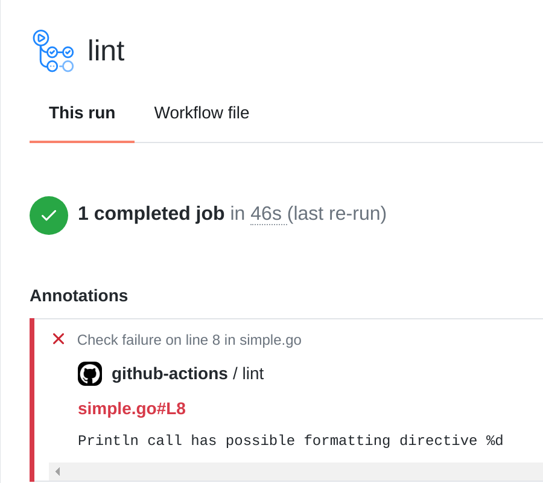
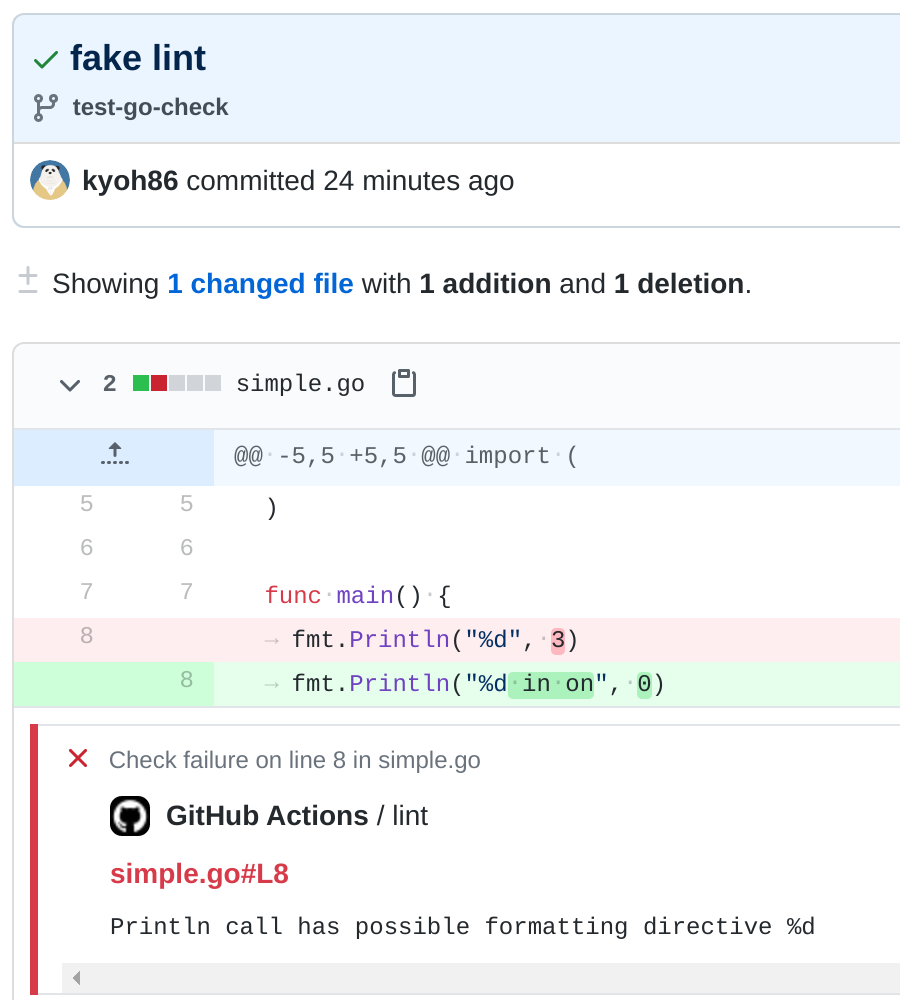

# go-check-action

Parse [go/analysis](https://pkg.go.dev/golang.org/x/tools/go/analysis) reports and anotate diagnostics on the GitHub

[](https://goreportcard.com/report/github.com/kyoh86/go-check-action)
[](https://codecov.io/gh/kyoh86/go-check-action)
[](https://github.com/kyoh86/go-check-action/releases)

## Example





## Usage

```yaml
    steps:
      - name: go vet
        run: go vet -json ./... 2> diagnostics.json

      - name: annotate diagnostics
        uses: kyoh86/go-check-action/annotate@v1
        with:
          level: error
          exit-code: 1
```

Get more information: [USAGE.md](USAGE.md)

# LICENSE

[](http://www.opensource.org/licenses/MIT)

This is distributed under the [MIT License](http://www.opensource.org/licenses/MIT).
